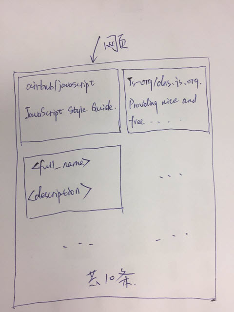

# Quest 1

## Description

Send an Ajax request to Github, searching repositories with the keyword
`javascript`.
And then show the first 10 repositories on web page.

The page layout should have 2 columns, and 2 repositories in each row.

## Details

* The endpoint of searching Github repositories is
  `https://api.github.com/search/repositories?q=javascript`.
  You could send a GET request to fetch the results list.
* Show `full_name` and `description` values on page.

## Steps

1. Create a new folder with your name, like `pzhong`, in Github repo:
  <https://github.com/CVBDL/have-a-try>.
2. Try to use Git and commit all of your JavaScript, CSS, and HTML to this folder.

## Related Techs

1. JavaScript
2. Ajax
3. CSS
4. HTML
5. Git and Github
