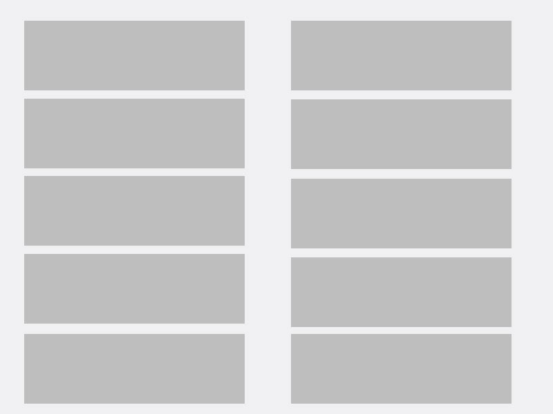
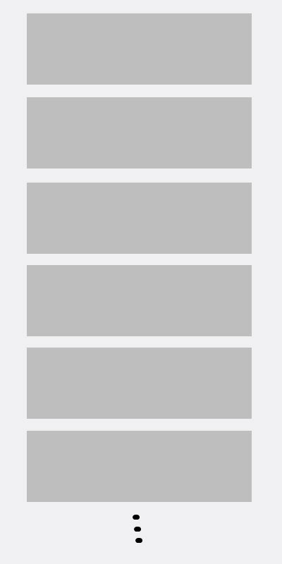

# Quest 2

## Precondition

Completed [Quest 1](../Q1)

## Description

When the width of device screen is greater than or equal to `768px`,
the layout should have 2 columns.

When the width of device screen is less than `768px`,
the layout should have 1 column.

## Details

I should be able to resize browser window size and review the layout changes.

## Related Techs

1. CSS / CSS3, Media query
1. Responsive design
1. You could make use of frameworks like bootstrap, but not recommended.
