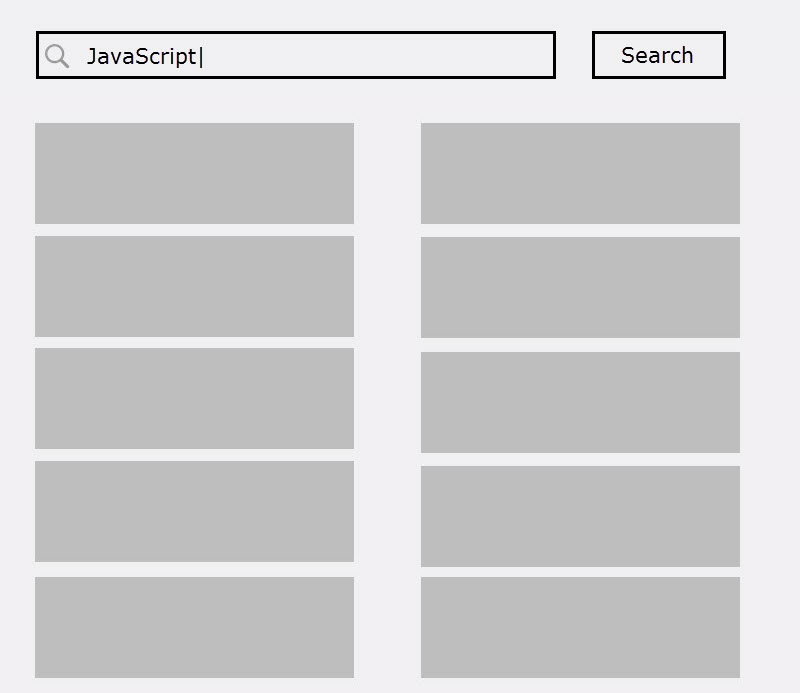

# Quest 3

## Precondition

Completed [Quest 1](../Q1) and [Quest 2](../Q2).

## Description

1. Structure your project.

  ```text
  project
    \css
    \img
    \lib
    \js
    \...
    index.html
    ...
  ```

2. Use JQuery to rewrite your Q1 and Q2 code.

  Try to use JQuery to manipulate DOM elements and send HTTP requests.

  * http://api.jquery.com/jQuery.get/
  * http://api.jquery.com/category/manipulation/

3. New feature: Add a search box

  Instead of fixing the search keyword to `javascript`, we want to let
  user input search keyword.

  When user click search button, it should search GitHub with input
  keyword and show the first 10 results.

4. User is able to search multiple times without refreshing the page.

  It means a user searched `javascript` first, and the page shows the
  first 10 results. Then user input `jquery` and click search button,
  it should show the first 10 results for `jquery`.

  

5. Good UI for both PC and mobile.
