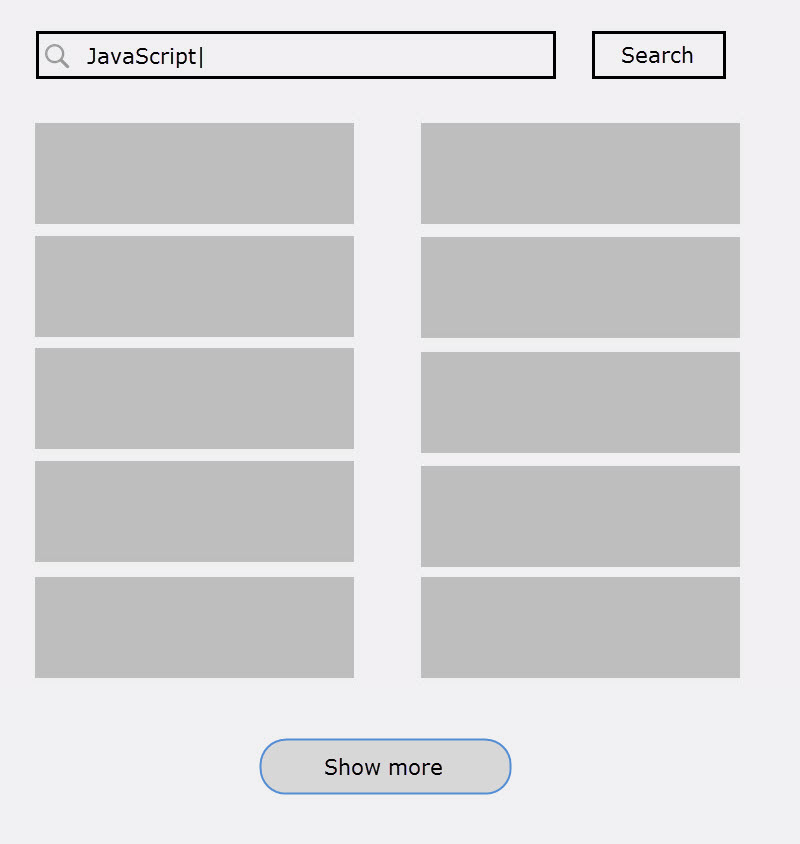

# Quest 5

## Precondition

Complete:

1. [Quest 1](../Q1)
1. [Quest 2](../Q2)
1. [Quest 3](../Q3)
1. [Quest 4](../Q4)

## Description

> Use JQuery instead of native APIs.

New feature:

1. Add a new button "Show more" at the bottom of page.
2. The button should be displayed when user did a search and there're
  more results to be shown.
3. It means at the time we open the page, the button is not shown.
4. When user click the button, 2 more results are displayed on page.
5. The button could be clicked multiple times, add 2 results for each clicking.
6. The button is in the center at the bottom.

## Goals

1. Get familiar with JQuery DOM manipulation APIs.
1. Get familiar with event handlers.
